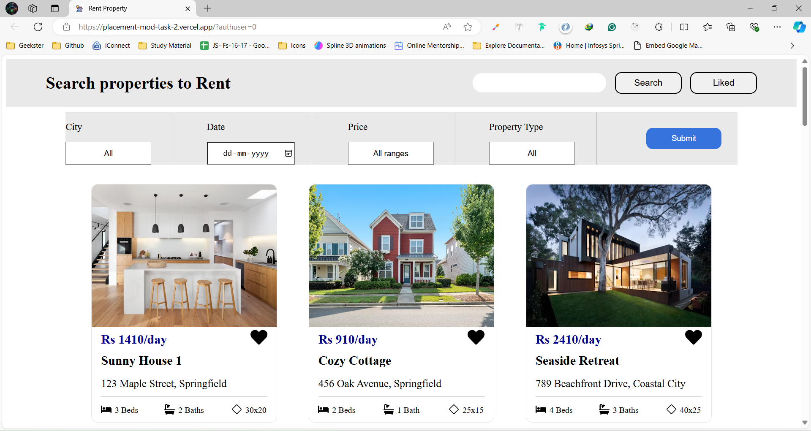
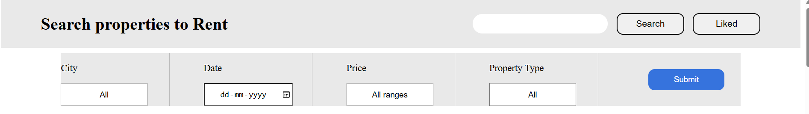
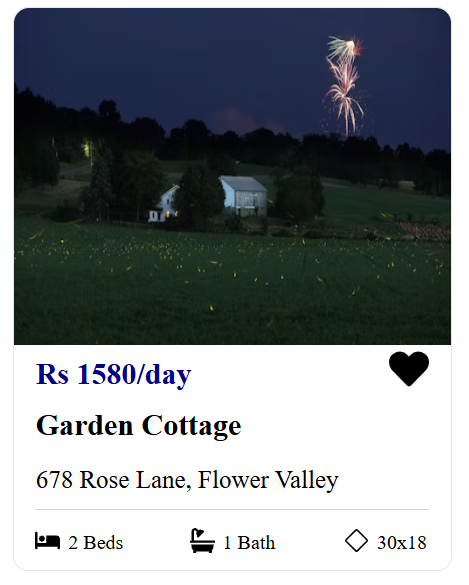

# Rent-a-Property

## Overview

Rent-a-Property is a web application built using React that allows users to search and filter properties available for rent. The project is designed with a modern UI and provides functionalities for filtering properties based on price, date, and type. Users can also like properties and view their liked properties.

## Components

### Homepage

- The main page where users can search and filter properties.
- Displays a list of properties with details like price, address, number of beds, number of baths, and room size.

### Navbar

- A navigation bar that includes a search field, liked properties button, and filters for city, date, price, and property type.

### Properties

- A card component that displays the details of each property.
- Includes a like button to mark properties as liked.

## Functionalities

- **Search Properties:** Users can search for properties based on different filters.
- **Filter by Price:** Properties can be filtered by different price ranges.
- **Filter by Date:** Properties can be filtered based on their availability date.
- **Filter by Type:** Properties can be filtered by type (Villa, Mansion, PG, House, Lodge).
- **Like Properties:** Users can like properties and view a list of liked properties.

## Extra Packages Used

- **react-icons:** For incorporating icons in the project.
- **sass:** For styling components using SCSS.

## Learning from the Project

- **React Context API:** Utilized the Context API to manage state across the application.
- **State Management:** Learned to handle complex state management with multiple filters and user interactions.
- **SCSS:** Improved skills in styling components using SCSS for better maintainability and reusability.
- **React Hooks:** Gained experience with React hooks such as `useState` and `useContext` to manage state and context in functional components.

## Future Improvements

- **Enhanced Filtering:** Implement more advanced filtering options such as location-based filtering and keyword search.
- **Pagination:** Add pagination to handle a large number of properties efficiently.
- **User Authentication:** Implement user authentication to allow users to save their liked properties and searches.
- **Improved UI/UX:** Enhance the user interface and experience with more animations and a responsive design for mobile devices.
- **Backend Integration:** Integrate a backend service to fetch real-time property data and handle user data securely.

## Hosted Link

Check out the live version of the project: [Rent-a-Property](https://placement-mod-task-2.vercel.app/)

## Author

- **Name:** [Shivam Bansal]
- **GitHub:** [Your GitHub Profile](https://github.com/Shivambansal96)
- **LinkedIn:** [Your LinkedIn Profile](https://linkedin.com/in/Shivambansal96)

---

Feel free to customize the links and add any additional information you think is necessary.